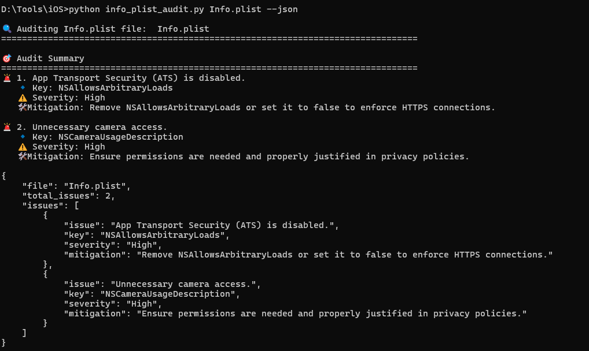

A "vibe coded" python based Info.plist Auditor script to audit Info.plist files for security misconfigurations.

* Features
- Detects ATS bypass, privacy violations, debug mode, and other security issues.
- Provides verbose output with severity levels and mitigations.
- Outputs results in JSON format for further analysis.


* Installation & Usage
```sh
git clone https://github.com/overlord3850/info-plist-auditor.git
cd info-plist-auditor
python info_plist_audit.py /path/to/Info.plist


